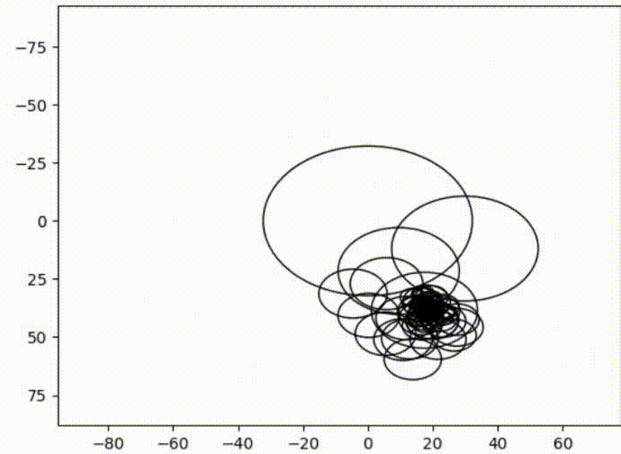

# Fourier_Image
## Draws the image features using Fourier Series.

This project uses Fourier Series and Fourier transform to draw any image. The image is read and it's features are extracted using the OpenCV library.

### Original image:

### Drawing the image using Fourier Series

To draw your own image, replace the image path with the path of your image in the main.py file.

## Note:
Make sure that the images are at most 225x225 pixels.
### Dependencies: 
  1. Numpy (4.1.1.26)
  2. OpenCV (1.17.0)
  3. Matplotlib (3.1.1)
